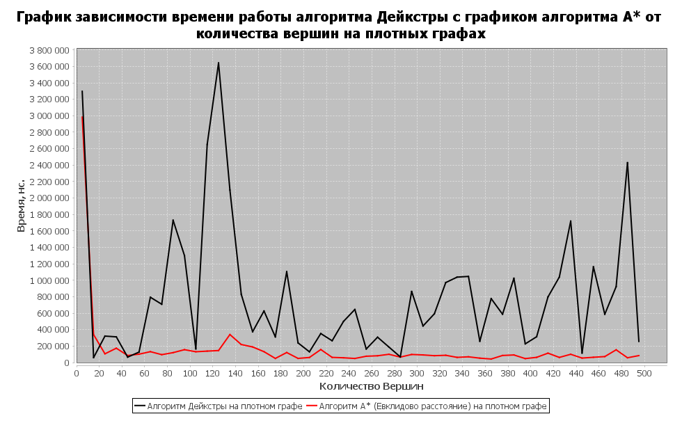
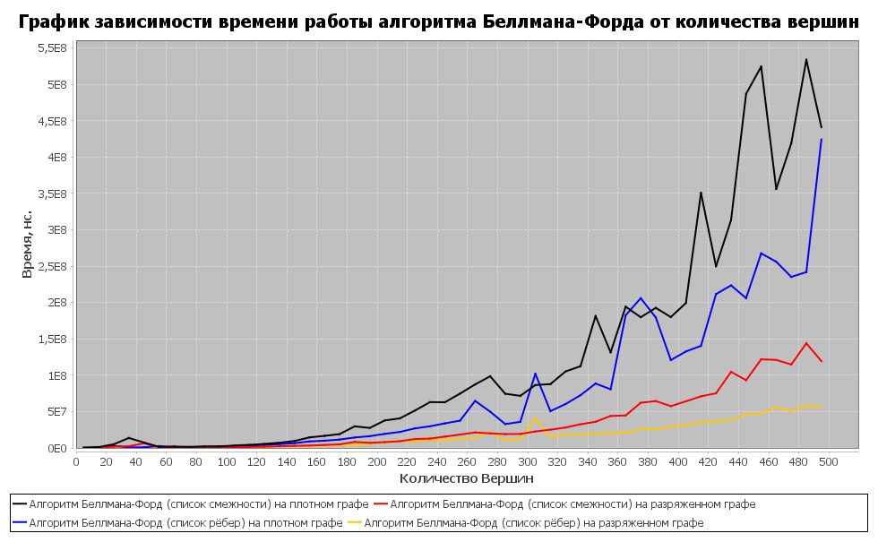

# Course-Work-Graphs 
«Comparative Complexity Analysis of Algorithms for Solving the Problem of Finding the Shortest Path in a Graph»
## Description:
#### Used algorithms:
* Dijkstra's algorithm
* Bellman–Ford algorithm
* A* search algorithm
#### Stack
* JGraphT
* JFreeChart
## Results examples:

